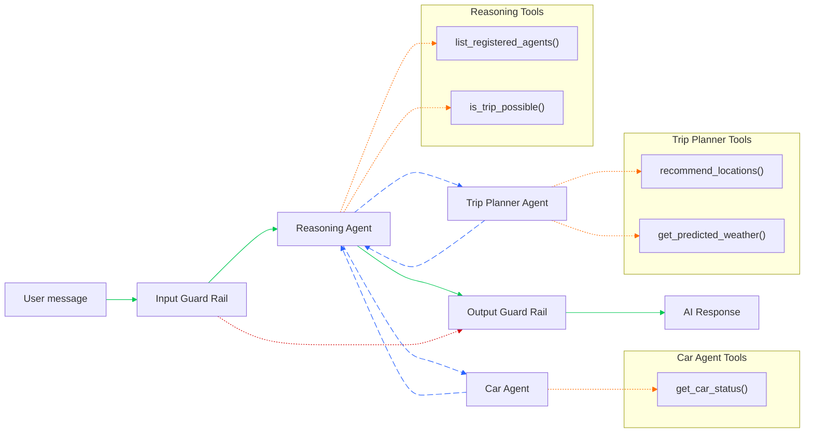

# Car System Agentic AI

An intelligent car management system powered by AI agents using LangGraph for orchestration and specialized agents for different domains.

Created for the presentation "Developing AI agents: fundamentals and practice" at the SECCOM 2025 (Semana Acadêmica da Computação e Sistemas) - _Academic week in Computer Science and Sistems_ - at the Federal University of Santa Catarina.

Palestrant: Klaus Begnis [@klausbegnis](https://github.com/klausbegnis)

Company: [@doutorie](https://www.instagram.com/doutorie/)
 
## Project Overview

This system provides intelligent car diagnostics and travel planning through a multi-agent architecture. Users can ask questions about their car status, trip feasibility, and get personalized travel recommendations with real-time weather information.

### Key Features

- 🔧 **Car Diagnostics**: Real-time vehicle status monitoring
- 🗺️ **Trip Planning**: Intelligent destination recommendations with weather forecasts
- ⛽ **Fuel Analysis**: Automatic trip feasibility calculations
- 🛡️ **Safety Guards**: Input/output validation for secure interactions
- 💬 **Interactive Chat**: Notebook-based conversational interface with memory

## 🤖 Agent Architecture

The system uses a multi-agent architecture with specialized agents coordinated by a central reasoning node:



### Agent Components Overview

| Component | Role | Key Capabilities | Tools | Language |
|-----------|------|------------------|-------|----------|
| **🧠 Reasoning Node** | Central coordinator and orchestrator | • Analyzes user intent and routes to agents<br>• Combines information from multiple agents<br>• Performs trip feasibility calculations<br>• Maintains conversation context | `list_registered_agents`<br>`invoke_agent`<br>`is_trip_possible` | Portuguese (pt-BR) |
| **🚗 Car Diagnostic Agent** | Vehicle status monitoring and diagnostics | • Retrieves current fuel levels and autonomy<br>• Provides car health status<br>• Answers technical questions about vehicle | `get_car_status` | Portuguese (pt-BR) |
| **🗺️ Trip Planner Agent** | Travel recommendations and destination planning | • Suggests destinations based on preferences<br>• Provides location info (coordinates, distance, time)<br>• Fetches real-time weather forecasts<br>• Filters by type (beach, mountain, historical) | `recommend_locations`<br>`get_predicted_weather` | Portuguese (pt-BR) |
| **🛡️ Input Guard Rail** | Input validation and security | • Validates and sanitizes user input<br>• Prevents malicious or invalid queries | Built-in validation | Portuguese (pt-BR) |
| **🛡️ Output Guard Rail** | Output validation and safety | • Ensures response quality and safety<br>• Sanitizes final responses | Built-in validation | Portuguese (pt-BR) |

## ⚠️ Important Notice

**This is a conceptual example and proof-of-concept implementation.** The current system uses simulated data and mock functions to demonstrate the multi-agent architecture and interaction patterns. It is designed for educational purposes and to showcase the potential of AI agent orchestration in automotive applications.

## 🛠️ Technology Stack

- **🐍 Python 3.12+**: Core programming language
- **🦜 LangChain**: LLM framework and tool integration
- **📊 LangGraph**: Multi-agent workflow orchestration
- **🔍 LangSmith**: LLM observability and debugging
- **🤖 Google Gemini**: Large language model (gemini-2.5-flash)
- **📓 Jupyter**: Interactive development environment
- **🔧 UV**: Fast Python package manager
- **📝 Pydantic**: Data validation and serialization

## 📁 Project Structure

```
car-system-agentic-ai/
├── src/
│   ├── models/           # LLM model implementations
│   ├── nodes/            # LangGraph node definitions
│   ├── tools/            # Agent tools and functions
│   ├── services/         # Core services (AgentRegistry)
│   ├── prompts/          # Agent prompt templates
│   └── utils/            # Utility functions
├── notebooks/            # Jupyter notebooks for interaction
├── data/                 # Agent configuration (JSON)
├── tests/                # Unit tests
└── docs/                 # Documentation
```

## Future Improvements

This proof-of-concept can be extended with production-ready features:

- **📚 RAG-Powered Manual Integration**: 
  - Implement Retrieval-Augmented Generation (RAG) to query car manuals
  - Compare current car status with maintenance schedules (from manuals)
  - Integration with OBD-II diagnostic codes and manufacturer specifications

- **🌤️ Live Weather API Integration**:
  - Replace mock weather data with real-time forecasts from OpenWeatherMap, AccuWeather, or similar APIs
  - Weather alerts and road condition warnings

- **📍 GPS and Location Services**:
  - Real-time distance calculations using Google Maps API or similar
  - Current location detection for accurate trip planning
  - Traffic-aware route optimization and travel time estimates

- **🗄️ PostgreSQL Checkpointer**:
  - Replace in-memory conversation storage with PostgreSQL database
  - Persistent conversation history across sessions

- **⚡ FastAPI Web Service**:
  - RESTful API endpoints for all agent interactions

- **🚗 Vehicle Integration**:
  - OBD-II port connectivity for real-time diagnostics
  - Integration with car manufacturer APIs (Tesla, BMW, etc.)
  - IoT sensor data collection and analysis
  - Predictive maintenance algorithms

- **🗺️ Travel Services Integration**:
  - Hotel and restaurant recommendations via APIs
  - Fuel station locator with price comparison
  - Tourist attraction information and reviews
  - Integration with travel booking platforms


## 🐳 Docker

### Quick Start

```bash
# Build and run with Docker Compose
docker-compose up --build

# Access the application
curl http://localhost:8083/health
```

### Manual Docker Build

```bash
# Build the image
docker build -f docker/Dockerfile -t car-system-ai .

# Run the container
docker run -p 8083:8083 car-system-ai
```

## 📚 Documentation

- [Installation Guide](docs/installation-guide.md) - Complete setup instructions with UV or pip
- [Environment Variables](docs/environment-variables.md) - Configuration and API key setup
- [Using Notebooks](docs/using-notebooks.md) - Guide for working with Jupyter notebooks
- [API Documentation](docs/api-documentation.md) - Complete API reference and examples

## 📝 License

MIT License.
